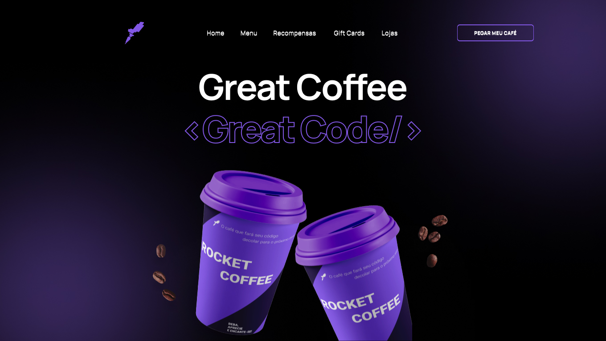

  
  <h1>RocketCoffee</h1>

  

## 🚀 Techs

[x] - [Vite](https://vitejs.dev/)

[x] - [React](https://reactjs.org/)

[x] - [Typescript](https://www.typescriptlang.org/)

[x] - [Styled-Components](https://styled-components.com/)
