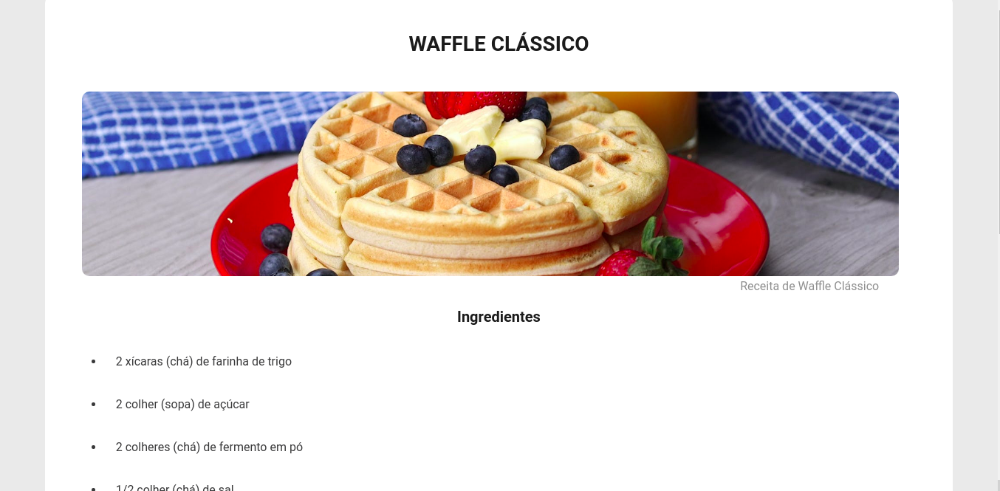

# Desafio Piloto: Página de Receita

  

## 📝 Desafio;

Nesse desafio foi criado uma página web de uma receita com título, imagem, lista de ingredientes e modo de preparo.O desafio está dividido em duas partes, no primeiro momento estrutura o HTML com as informações da receita e na segunda parte adicionar os estilos à página com o CSS.[link do desafio](https://efficient-sloth-d85.notion.site/Desafio-Piloto-P-gina-de-Receita-15acc6a34f744484a2e64a1f115bfbae)

## Licença

Esse projeto está sob a licença MIT. Veja o arquivo [LICENSE](LICENSE.md) para mais detalhes.
